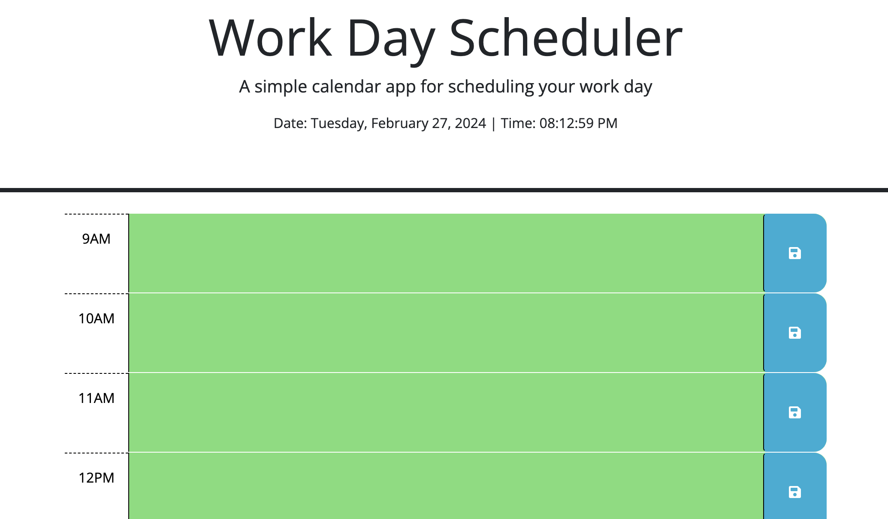

# Calendar-Scheduler

## Description

This project is a calendar scehduler. It uses HTML, CSS, JavaScript. HTML was used to build the rows and display 
the information. CSS was helped to add some color, the color helps signifies what time has passed, what time hasn't 
passed and what's the current time. I tried building this and finishing the code to complete the challenge assignment but to also better my understanding of using API's and better my knowledge of jQuery and DayJS. I learned that documentation and understanding of basic JavaScript in order to use the added databases is very important and crucial to better understand and memorize the functions of the new code added from DayJS and jQuery.

## Table of Contents

- [Usage](#usage)
- [Credits](#credits)
- [License](#license)

## Usage

To use the website, just type in the plans you have for each hour in the row, and hit the save button on the sides to save to the storage. 

## Credits

- https://www.youtube.com/watch?v=QhQ4m5g2fhA&pp=ygUGanF1ZXJ5 - jQuery Basics
- Thomas Calle - Youtube on similar assignment and helped break down some things and show how to use the dayJS 
- Victor Ekpo 
- Jason Xie 
- CodeCademy 
- Udemy 

## License

MIT License

Copyright (c) 2024 A13xGON

Permission is hereby granted, free of charge, to any person obtaining a copy
of this software and associated documentation files (the "Software"), to deal
in the Software without restriction, including without limitation the rights
to use, copy, modify, merge, publish, distribute, sublicense, and/or sell
copies of the Software, and to permit persons to whom the Software is
furnished to do so, subject to the following conditions:

The above copyright notice and this permission notice shall be included in all
copies or substantial portions of the Software.

THE SOFTWARE IS PROVIDED "AS IS", WITHOUT WARRANTY OF ANY KIND, EXPRESS OR
IMPLIED, INCLUDING BUT NOT LIMITED TO THE WARRANTIES OF MERCHANTABILITY,
FITNESS FOR A PARTICULAR PURPOSE AND NONINFRINGEMENT. IN NO EVENT SHALL THE
AUTHORS OR COPYRIGHT HOLDERS BE LIABLE FOR ANY CLAIM, DAMAGES OR OTHER
LIABILITY, WHETHER IN AN ACTION OF CONTRACT, TORT OR OTHERWISE, ARISING FROM,
OUT OF OR IN CONNECTION WITH THE SOFTWARE OR THE USE OR OTHER DEALINGS IN THE
SOFTWARE.
---

## How to Contribute

If you are reading this, help me out by sending me feedback on what I could do with the code better. Also, send me links and projects and problems to solve to better my understanding of coding as a whole!
